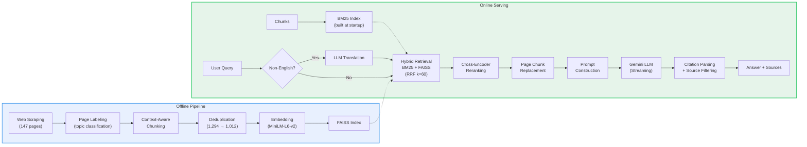

# UChicago Applied Data Science Q&A


A RAG-based Q&A system for the University of Chicago's MS in Applied Data Science program. Users can ask questions about admissions, curriculum, career outcomes, and more — the system retrieves relevant information from the program website and generates answers using an LLM.

**Live Demo:** https://uchicago-ads-rag.web.app

**Interactive Course:** [How This RAG System Works](https://michellexpeng.github.io/UChicago_ADS_RAG/course.html) — an interactive single-page course that explains the entire pipeline visually, for non-technical readers.


---

## What I Learned Building This

### Chunking matters more than embedding

I evaluated 4 embedding models (MiniLM, BGE-M3, E5-large, Gemini) and the recall gap was only ~5%. What made the real difference was **how I split the documents**.

My first approach used `RecursiveCharacterTextSplitter(chunk_size=800, chunk_overlap=150)` on raw page text. This caused two concrete problems:

1. **Mid-sentence fragmentation** — A biography on the Data Science Clinic page got split mid-paragraph, producing a chunk starting with *"hundreds of students into top data science positions...90% within 3 months of graduation"* — with zero context that this was describing a staff member's previous role at USF, not UChicago's placement rate
2. **Semantic pollution** — That orphaned chunk contained keywords like "job placement" and "graduation" that made it rank highly for career queries, causing the LLM to confidently attribute USF's 90% placement rate to UChicago ADS

The fix was **context-aware paragraph splitting**: split on `\n\n` first to preserve paragraph boundaries, use sentence-boundary separators (`". "`, `"? "`, `"! "`) for long paragraphs, and prefix every section chunk with `[Page Title]` so the cross-encoder can distinguish "Data Science Clinic staff bio" from "Career Outcomes data." This single change eliminated the hallucination.

Structure-aware chunking for accordion pages (FAQ, Course Progressions, etc.) was equally important — splitting by HTML structure rather than character count kept each Q&A pair and course description as an atomic unit. **Parent + child chunking** turned out to be critical: "what courses are in the Machine Learning track?" hits a specific course sub-chunk, while "tell me about the curriculum" matches the parent accordion chunk covering all tracks.

### Retrieval is where precision is won or lost

**Hybrid BM25 + semantic search** with RRF fusion consistently beat either method alone, but the details mattered:

- **Domain-specific synonym expansion** was a small effort with outsized impact. Mapping "tuition" ↔ "cost/fee/price" and "duration" ↔ "how long/quarters/years" caught queries that semantic search would handle but BM25 would completely miss — and in a hybrid system, a zero BM25 score drags down the fused ranking
- **BM25 tokenization quality** — Switching from naive `.lower().split()` to proper tokenization with stopword removal and simple stemming (e.g., "courses" → "course", "studies" → "study") improved BM25 precision significantly. Without stemming, "what courses are available?" wouldn't match chunks containing "course" (singular)
- **Heading-overlap boosting** was a surprisingly effective signal — when a chunk's heading matches the query keywords, it's almost always relevant. I gave structured content (accordions, page-level sections) a 2x boost multiplier, which noticeably improved precision for navigational queries like "what are the core courses?"
- **Label-based intent matching** — Each chunk carries topic labels (admission, course, fee, career, etc.) assigned during chunking. When the query's intent matches a chunk's label, it gets a small RRF boost. This acts as a lightweight topic filter that helps surface domain-relevant chunks
- **Soft URL penalty vs hard cap** — My first version capped each URL to 3 chunks in retrieval results. This caused a subtle bug: for the GRE FAQ, other FAQ chunks from the same page consumed the 3-slot cap before the actual GRE answer chunk could surface. Replacing the hard cap with a soft penalty (`score *= 0.9^n` for the nth chunk from the same URL) preserved source diversity without silently dropping relevant results
- **Cross-encoder reranking** was the single biggest quality boost for top-5 precision — but also the latency bottleneck (70% of pre-LLM time). PyTorch CPU inference for 15 query-document pairs took ~2s on Cloud Run. Switching to **ONNX Runtime** with pre-exported models and `max_length=256` truncation brought this down to ~0.9s. The key insight: `sentence-transformers`' built-in ONNX backend still calls the HuggingFace API at runtime (which gets rate-limited on Cloud Run IPs), so I exported the models locally with `torch.onnx.export` and baked the `.onnx` files directly into the Docker image
- For **Chinese queries**, I discovered that BM25 and the cross-encoder are English-only bottlenecks — adding LLM-based translation *before* retrieval (not after) solved inconsistent results
- **Page chunk replacement** — For broad queries like "What are the admission requirements?" the system retrieves 3+ section chunks from the same page (personal statement, recommendation letters, English proficiency, etc.), each with only partial information. When this happens, the system automatically replaces those fragments with the full page-level chunk, giving the LLM complete context to synthesize a comprehensive answer

### Why LLM-based query rewriting didn't work here

Users sometimes ask vague questions — e.g., "Which professor teaches AI related courses?" retrieves different chunks than the more specific "Who teaches generative AI?", leading to inconsistent answers. This is a known limitation of single-pass retrieval: different wordings produce different embeddings and different BM25 matches.

I experimented with two LLM-based approaches to address this:

1. **Query Rewriting** — Rewrite the user's query into a keyword-rich search query before retrieval. Result: Recall@5 dropped from 0.911 to 0.336. The rewritten queries were bloated with keywords that diluted the embedding vector (MiniLM's 384 dimensions can't encode 7 concepts at once) and weakened BM25's term discrimination.

2. **HyDE (Hypothetical Document Embeddings)** — Generate a hypothetical answer with the LLM, then use its embedding for semantic search (while keeping BM25 on the original query). Result: also underperformed baseline. The LLM (Gemini) lacks specific knowledge about the UChicago ADS program, so its hypothetical answers contained fabricated details (wrong professor names, invented course titles) that pushed the embedding away from the actual documents.

Both approaches share the same fundamental problem: **they inject an LLM's general knowledge into a domain-specific retrieval pipeline.** When the LLM doesn't know the domain well, its "help" is noise. The retrieval pipeline already has strong lexical signals (BM25 + synonym expansion) and a cross-encoder reranker — adding an LLM step before retrieval just introduces another source of error.

For this project, the better path is improving retrieval signals directly: expanding the synonym dictionary, refining chunk boundaries, and tuning BM25/boost weights. These are deterministic and verifiable, unlike LLM-generated query transformations.

### Generation: the LLM is the easy part

I migrated from OpenAI GPT to **Gemini 2.5 Flash Lite** expecting a quality tradeoff, but the results were on par — with much better latency and cost. For a domain-specific RAG where the context does most of the heavy lifting, a lighter LLM works just fine.

But **prompt wording directly controls hallucination**. My first prompt said "treat the context as a direct answer," which caused the LLM to confidently fabricate details from partially relevant chunks (e.g., listing wrong instructors for a course). Changing it to "answer what you can and clearly state which part is not covered" struck the right balance — users get useful partial answers without being misled.

I also implemented **citation-based source filtering**: the LLM cites [Doc1], [Doc3] in its answer, and only those sources are shown to the user. This eliminated the "irrelevant links" problem that most RAG demos have.

### Evaluation: the hardest part nobody talks about

Building an honest evaluation pipeline was harder than building the RAG system itself.

**Automated metrics (RAGAS) got me started** — faithfulness and answer relevancy told me *where* the system was weak. But they couldn't tell me *why*. Only by reading actual bad answers could I trace the root cause to a chunking boundary, a missing synonym, or a misleading prompt instruction.

**The golden test set trap** — My first approach was to auto-annotate relevant chunks using the system's own retrieval + cross-encoder scores. This is circular: the test set rewards whatever the system already does well, and Recall@5 came out at 0.994 — suspiciously perfect. The honest approach was **manual annotation**: for each of 55 queries, I read the chunks and asked "if the LLM only sees this one chunk, can it correctly answer the question?" This brought Recall@5 down to 0.944 — still strong, but honest, and it exposed real gaps (e.g., career queries missing company list chunks).

The iterative loop of "measure → inspect failures → hypothesize → fix → re-measure" was the real methodology behind this project. Each improvement came from a specific failure case, not from theoretical optimization.

---

## How It Works

The system is built as a full RAG pipeline with two phases:

**Offline Pipeline** — Run once (or when the source website changes) to prepare the knowledge base:
1. **Web Scraping** (`notebooks/rag_pipeline.ipynb`) — Crawl 147 pages from the UChicago ADS website, preserving raw HTML
2. **Page Labeling** (`scripts/prepare_chunks.py`) — Classify each page by topic (admission, course, fee, career, etc.) using keyword-group scoring
3. **Context-Aware Chunking** — Split pages into 1,294 chunks:
   - Accordion pages (FAQ, courses, schedule): split by HTML structure, each item is an atomic chunk
   - Generic pages: paragraph-first splitting with `[Page Title]` context prefix, sentence-boundary-aware for long paragraphs
   - Every page also generates a page-level parent chunk for broad queries
4. **Deduplication** — Remove near-duplicate chunks (Jaccard similarity > 0.85), reducing 1,294 → 1,012 chunks
5. **Embedding & Indexing** — Encode all chunks with MiniLM-L6-v2 (384-dim) and build a FAISS inner-product index

**Online Serving** (`main.py`) — BM25 index is built from chunk text at server startup. For each user query:
1. **Query Translation** — Non-English queries are translated to English via Gemini LLM, since BM25 and the cross-encoder are English-only
2. **Hybrid Retrieval** — BM25 (with stemming + synonym expansion) and FAISS semantic scores are fused via Reciprocal Rank Fusion (k=60), enhanced by heading-overlap boost, label-intent boost, and soft URL diversity penalty
3. **Cross-Encoder Reranking** — Top 15 candidates are re-scored with `ms-marco-MiniLM-L-6-v2` via ONNX Runtime (~0.9s on Cloud Run)
4. **Page Chunk Replacement** — If 3+ reranked hits come from the same page, replace them with the page-level chunk for complete context
5. **Prompt Construction** — Retrieved chunks are labeled [Doc1], [Doc2], etc. The prompt instructs the LLM to cite sources and respond in the user's language
6. **Streaming Generation** — Gemini 2.5 Flash Lite generates a token-by-token response via SSE
7. **Citation Filtering** — Only source links actually cited by the LLM are returned; "I don't know" answers suppress all links

## Architecture



- **Backend** — FastAPI server (`main.py` + modular `retrieval.py`, `prompt.py`, `embedder.py`, `onnx_models.py`)
- **Frontend** — React + Vite + Tailwind chat interface with real-time streaming

---

## Key Features

| Feature | Description |
|---------|-------------|
| Context-aware chunking | Paragraph-first splitting with `[Page Title]` prefix; accordion pages split by HTML structure |
| Hybrid retrieval | BM25 (stemming + synonym expansion) + FAISS semantic search, fused via RRF |
| Multi-signal boosting | Heading-overlap boost, label-intent boost, soft URL diversity penalty |
| Cross-encoder reranking | Re-scores candidates with `ms-marco-MiniLM-L-6-v2` for higher precision |
| Page chunk replacement | Broad queries get full page context instead of fragmented section hits |
| Chinese query support | Translates non-English queries to English for retrieval, responds in user's language |
| Citation-based sources | Only shows source links the LLM actually referenced in its answer |
| Streaming responses | Real-time token-by-token output via Server-Sent Events |

---

## Evaluation

### Golden Test Set Results

Evaluated on **55 manually-annotated queries** across 7 categories using the full retrieval + reranking pipeline (`eval.py`):

| Metric | Score |
|--------|-------|
| **Recall@5** | **0.944** |
| **MRR** | **0.973** |
| **NDCG@10** | **0.950** |
| Recall@1 | 0.507 |
| Recall@3 | 0.929 |
| Recall@10 | 0.966 |

#### Per-Category Breakdown

| Category | Queries | Recall@5 | MRR |
|----------|---------|----------|-----|
| Admission | 16 | 0.961 | 1.000 |
| Course | 19 | 0.961 | 1.000 |
| Fee | 7 | 1.000 | 0.929 |
| Capstone | 6 | 0.944 | 1.000 |
| Career | 4 | 0.658 | 0.875 |
| Application | 2 | 1.000 | 1.000 |
| Contact | 1 | 1.000 | 0.500 |

The career category has the lowest recall because relevant answers span multiple chunk types (narrative descriptions + hard-coded company/salary lists), making it harder to surface all relevant chunks within top-5.

#### Annotation Methodology

Each query was manually annotated by reviewing chunk text and asking: *"If the LLM only sees this chunk, can it correctly answer the question?"* Average 2.4 relevant chunks per query. Auto-annotation (using the system's own retrieval scores) was deliberately avoided to prevent circular evaluation — see "What I Learned" for details.

### RAGAS: Generation Quality

End-to-end evaluation using [RAGAS](https://docs.ragas.io/) on the same 55-query golden test set. The full pipeline runs for each query (retrieve → rerank → Gemini 2.5 Flash Lite generates answer), then `gemini-2.5-flash` judges faithfulness and answer relevancy (`python eval.py --mode ragas`):

| Metric | Score |
|--------|-------|
| **Faithfulness** | **0.962** |
| **Answer Relevancy** | **0.663** |

#### Per-Category Breakdown

| Category | Queries | Faithfulness | Answer Relevancy |
|----------|---------|--------------|------------------|
| Admission | 16 | 0.956 | 0.712 |
| Course | 19 | 0.953 | 0.656 |
| Fee | 7 | 1.000 | 0.514 |
| Capstone | 6 | 0.986 | 0.810 |
| Career | 4 | 1.000 | 0.479 |
| Application | 2 | 0.775 | 0.621 |
| Contact | 1 | 1.000 | 0.997 |

> **Faithfulness is high (0.96)** — the LLM rarely hallucinates beyond the retrieved context. **Answer Relevancy is lower (0.66)**, primarily due to the evaluation method: RAGAS measures relevancy by generating questions from the answer and comparing embeddings back to the original query. Chinese queries score poorly (avg 0.39 vs English 0.70) because the local MiniLM embeddings used for this comparison are English-only. Short/informal queries ("GRE?", "deadline", "how much does it cost") also score low despite correct answers.

### Ablation Study

Each stage adds one component to the pipeline. All evaluated on the same 55-query golden test set (`python eval.py --mode ablation`):

| Stage | Recall@5 | MRR | ΔR@5 | What Changed |
|-------|----------|-----|------|--------------|
| 1. FAISS only | 0.455 | 0.526 | — | Semantic search baseline |
| 2. + BM25 hybrid (RRF) | 0.528 | 0.624 | +0.073 | Added lexical matching via Reciprocal Rank Fusion |
| 3. + Boosting + reranking | 0.663 | 0.755 | +0.135 | Synonym expansion, heading/label boost, URL penalty, cross-encoder |
| 4. + Deduplication | **0.944** | **0.973** | **+0.281** | Removed 282 near-duplicate chunks (Jaccard > 0.85) |

> Deduplication had the largest single impact (+0.281 Recall@5). Near-duplicate chunks were consuming top-K slots with redundant content, preventing the truly relevant chunk from surfacing. Boosting signals (synonym expansion, heading/label boost, URL penalty) were designed to work with the cross-encoder reranker — in isolation they can hurt precision by promoting false positives that the reranker would otherwise filter out.

### Chunking Statistics

| Metric | Value |
|--------|-------|
| Source pages crawled | 147 |
| Chunks before dedup | 1,294 |
| Chunks after dedup | 1,012 |
| Dedup threshold | Jaccard > 0.85 |

| Chunk Type | Count | Description |
|------------|-------|-------------|
| section | 759 | Paragraph-level chunks with `[Page Title]` prefix |
| page | 131 | Full page text (parent chunks for broad queries) |
| accordion_faq | 36 | Individual FAQ Q&A pairs |
| accordion_course | 35 | Individual course descriptions |
| accordion_schedule | 19 | Quarter/schedule breakdowns |
| accordion | 18 | Generic accordion items |
| accordion_job | 14 | Job/internship listings |

### Embedding Model Comparison

Four embedding models were evaluated on retrieval quality and end-to-end answer quality (see [`embedding_comparison.ipynb`](backend/notebooks/embedding_comparison.ipynb)):

| Model | Dim | Recall@1 | Recall@5 | Faithfulness | Answer Relevancy | Encode Time |
|-------|-----|----------|----------|--------------|------------------|-------------|
| MiniLM-L6 (baseline) | 384 | 0.310 | 0.590 | 0.90 | 0.783 | 2.9s |
| BGE-M3 | 1024 | 0.330 | 0.630 | **1.00** | 0.759 | 53.3s |
| E5-large-instruct | 1024 | 0.300 | 0.590 | 0.90 | 0.764 | 45.4s |
| **Gemini-Embed-001** | 3072 | **0.360** | **0.640** | 0.91 | **0.790** | 14.5s |

> These scores use pseudo-query evaluation (first sentence of each chunk as query, 100 samples) with the full hybrid pipeline. Cross-encoder reranking was excluded from recall measurement to isolate embedding quality. The modest recall differences across models confirm that retrieval quality is dominated by chunking strategy, BM25 fusion, and reranking rather than embedding choice.

**Decision: MiniLM-L6-v2 over Gemini-Embed-001.** Gemini won the early-stage comparison, but after building the full hybrid pipeline I chose to stay with MiniLM for three reasons:

1. **No truncation where it matters** — MiniLM's 256-token context window is a known limitation, but all 759 section chunks (the primary retrieval targets) are under 150 words. The 131 page-level chunks *do* get truncated, but they're injected post-retrieval via `_inject_page_chunks()` — their embedding quality is irrelevant since they bypass FAISS entirely
2. **Hybrid pipeline compensates** — BM25 with synonym expansion handles the lexical matching that short embeddings miss, and the cross-encoder reranker rescores based on full text. The ~5% recall gap between MiniLM and Gemini in semantic-only mode largely disappears once these layers are added
3. **Zero API dependency at inference** — MiniLM runs locally in ~3ms per query. Gemini embedding requires an API call per query, adding latency and a point of failure. For a real-time chat interface, local inference is a better tradeoff

---

<details>
<summary><strong>Project Structure</strong></summary>

```
backend/
  main.py              # FastAPI app, endpoints, page chunk replacement
  embedder.py          # Google Gemini Embedding API wrapper
  retrieval.py         # Hybrid retrieval (BM25 + FAISS + RRF), reranking, boosting
  prompt.py            # Prompt construction, query translation, citation parsing
  onnx_models.py       # ONNX Runtime inference wrappers (embedder + cross-encoder)
  eval.py              # Evaluation: Recall@K, MRR, NDCG, RAGAS (faithfulness & relevancy)
  requirements.txt
  Dockerfile           # Backend container (Cloud Run)
  .env.example         # Environment variable template
  data/
    chunked_documents_dedup.json    # 1,012 chunks (production, after dedup)
    embeddings_dedup.npy            # MiniLM embeddings (1012 x 384)
    uchicago_ads_faiss_dedup.index  # FAISS index (MiniLM, deduped)
    golden_test_set.json            # 55 manually-annotated evaluation queries
    ragas_eval_results.json         # RAGAS evaluation results (per-query scores + answers)
    uchicago_ads_pages_depth3.json  # Raw crawled pages (147 pages)
  models/                           # Pre-exported ONNX models (not in git, baked into Docker)
    minilm_embedder.onnx            # MiniLM-L6-v2 embedding model (87MB)
    cross_encoder.onnx              # ms-marco-MiniLM-L-6-v2 reranker (87MB)
  notebooks/
    rag_pipeline.ipynb              # Early-stage pipeline exploration (web crawl is here!)
    rag_pipeline_updated.ipynb      # Updated pipeline walkthrough
    debug_pipeline.ipynb            # Step-by-step retrieval pipeline debugger
    test_chunking.ipynb             # Chunking validation across page types
    embedding_comparison.ipynb      # MiniLM vs BGE-M3 vs E5 vs Gemini comparison
    ab_test_query_rewrite.ipynb     # A/B test for query rewrite and HyDE
  scripts/
    prepare_chunks.py               # Full pipeline: label → chunk → dedup → embed → index

frontend/
  src/
    App.tsx            # Main app, API streaming logic
    components/
      ChatMessage.tsx  # Message rendering + source links
      ChatInput.tsx    # Text input + send button
      SampleQuestions.tsx  # Sidebar with sample questions
  Dockerfile           # Frontend container (Nginx, for docker-compose)
  firebase.json        # Firebase Hosting config

docker-compose.yml     # Local multi-container setup
deploy.sh              # One-click GCP deployment script
```

</details>

<details>
<summary><strong>Quick Start</strong></summary>

### Backend

```bash
cd backend

# Install dependencies
pip install -r requirements.txt

# Set environment variables
echo "GOOGLE_API_KEY=your-key-here" > .env

# (Optional) Rebuild chunks from scratch
python scripts/prepare_chunks.py

# Start the server
uvicorn main:app --reload --host 0.0.0.0 --port 8000
```

### Frontend

```bash
cd frontend

# Install dependencies
npm install

# Start the dev server
npm run dev
```

Open http://localhost:5173

</details>

<details>
<summary><strong>Environment Variables</strong></summary>

| Variable | Required | Default | Description |
|----------|----------|---------|-------------|
| `GOOGLE_API_KEY` | Yes | — | Google AI API key for Gemini LLM and embeddings |
| `EMBEDDING_MODEL` | No | `minilm` | Embedding model: `minilm` (local) or `gemini` (API) |
| `USE_ONNX` | No | `true` | Use ONNX Runtime for inference (`true`) or PyTorch (`false`) |
| `USE_DEDUP` | No | `true` | Use deduplicated chunks (`true`) or full set (`false`) |
| `ALLOWED_ORIGINS` | No | `*` | Comma-separated CORS origins |
| `VITE_API_URL` | No | `http://localhost:8000` | Backend URL for the frontend |

</details>

<details>
<summary><strong>Deployment</strong></summary>

The app is deployed on Google Cloud Platform:
- **Backend** — Cloud Run (containerized FastAPI)
- **Frontend** — Firebase Hosting (static files + CDN)

### Deploy with Docker (local)

```bash
docker-compose up --build
# Frontend: http://localhost  |  Backend: http://localhost:8000
```

### Deploy to GCP

Prerequisites: `gcloud` CLI, Firebase CLI, a GCP project with billing enabled.

```bash
# One-click deploy
./deploy.sh
```

The script builds and deploys the backend to Cloud Run, then builds the frontend and deploys to Firebase Hosting. See `deploy.sh` for details.

</details>
