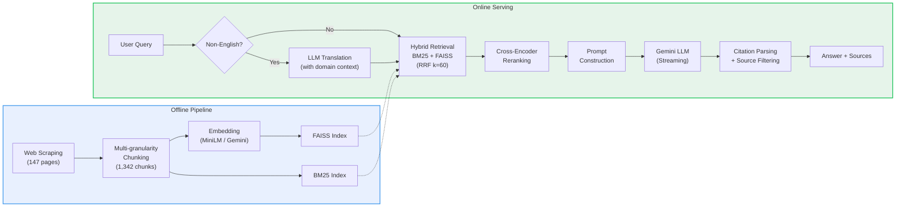

# UChicago Applied Data Science Q&A


A RAG-based Q&A system for the University of Chicago's MS in Applied Data Science program. Users can ask questions about admissions, curriculum, career outcomes, and more — the system retrieves relevant information from the program website and generates answers using an LLM.

**Live Demo:** https://uchicago-ads-rag.web.app


---

## What I Learned Building This

### Chunking matters more than embedding

I evaluated 4 embedding models (MiniLM, BGE-M3, E5-large, Gemini) and the recall gap was only ~5%. What made the real difference was **how I split the documents**. Structure-aware chunking that respects HTML semantics (accordions split by course/quarter/FAQ) consistently outperformed fixed-size splitting. **Parent + child chunking** turned out to be critical — a query like "what courses are in the Machine Learning track?" hits a specific course sub-chunk, while "tell me about the curriculum" matches the parent accordion chunk that covers all tracks. Fixed-size splitting would either miss the detail or lose the overview.

### Retrieval is where precision is won or lost

**Hybrid BM25 + semantic search** with RRF fusion consistently beat either method alone, but the details mattered:
- **Domain-specific synonym expansion** was a small effort with outsized impact. Mapping "tuition" ↔ "cost/fee/price" and "duration" ↔ "how long/quarters/years" caught queries that semantic search would handle but BM25 would completely miss — and in a hybrid system, a zero BM25 score drags down the fused ranking
- **Heading-overlap boosting** was a surprisingly effective signal — when a chunk's heading matches the query keywords, it's almost always relevant. I gave structured content (accordions, page-level sections) a 2x boost multiplier, which noticeably improved precision for navigational queries like "what are the core courses?"
- **Cross-encoder reranking** was the single biggest quality boost for top-5 precision
- For **Chinese queries**, I discovered that BM25 and the cross-encoder are English-only bottlenecks — adding LLM-based translation *before* retrieval (not after) solved inconsistent results

### Generation: the LLM is the easy part

I migrated from OpenAI GPT to **Gemini 2.5 Flash Lite** expecting a quality tradeoff, but the results were on par — with much better latency and cost. For a domain-specific RAG where the context does most of the heavy lifting, a lighter LLM works just fine.

But **prompt wording directly controls hallucination**. My first prompt said "treat the context as a direct answer," which caused the LLM to confidently fabricate details from partially relevant chunks (e.g., listing wrong instructors for a course). Changing it to "answer what you can and clearly state which part is not covered" struck the right balance — users get useful partial answers without being misled.

I also implemented **citation-based source filtering**: the LLM cites [Doc1], [Doc3] in its answer, and only those sources are shown to the user. This eliminated the "irrelevant links" problem that most RAG demos have.

### Methodology: measure + read the failures

Most of these improvements came from **combining RAGAS metrics with manual error analysis**. Automated evaluation (faithfulness, answer relevancy) told me *where* the system was weak, but only by reading the actual bad answers could I figure out *why* — a wrong synonym, a misleading prompt instruction, or a chunking boundary that split critical information. The iterative loop of "measure → inspect failures → hypothesize → fix → re-measure" was the real methodology behind this project.

---

## How It Works

The system is built as a full RAG pipeline with two phases:

**Offline Pipeline** — Run once (or when the source website changes) to prepare the knowledge base:
1. **Web Scraping** — Crawl 147 pages from the UChicago ADS website, preserving HTML structure
2. **Multi-granularity Chunking** — Split pages into 1,342 chunks using structure-aware extractors: accordion items are split by quarter/course/FAQ/job; generic pages use recursive character splitting (800 chars, 150 overlap). Each chunk carries metadata (source URL, heading, chunk type, labels)
3. **Embedding & Indexing** — Encode all chunks with a sentence embedding model (MiniLM-L6 or Gemini-Embed-001) and build a FAISS inner-product index. A BM25 index is built in parallel for lexical matching

**Online Serving** — For each user query:
1. **Query Translation** — Non-English queries (detected by character encoding) are translated to English with domain context, since BM25 and the cross-encoder are English-only
2. **Hybrid Retrieval** — BM25 and FAISS scores are fused via Reciprocal Rank Fusion (k=60), with heading-overlap boosting and per-URL deduplication
3. **Cross-Encoder Reranking** — Top candidates are re-scored with `ms-marco-MiniLM-L-6-v2` for precision
4. **Prompt Construction** — Retrieved chunks are labeled [Doc1], [Doc2], etc. The prompt instructs the LLM to cite sources and respond in the user's language
5. **Streaming Generation** — Gemini LLM generates a token-by-token streamed response via SSE
6. **Citation Filtering** — Only source links actually cited by the LLM are returned; "I don't know" answers suppress all links

## Architecture



- **Backend** — FastAPI server (`main.py` + modular `embedder.py`, `retrieval.py`, `prompt.py`)
- **Frontend** — React + Vite + Tailwind chat interface with real-time streaming

---

## Key Features

| Feature | Description |
|---------|-------------|
| Hybrid retrieval | BM25 lexical + FAISS semantic search, fused via Reciprocal Rank Fusion (RRF) |
| Cross-encoder reranking | Re-scores candidates with `ms-marco-MiniLM-L-6-v2` for higher precision |
| Synonym expansion | Maps domain terms (e.g., "tuition" ↔ "cost", "fee", "price") for better BM25 recall |
| Chinese query support | Translates non-English queries to English for retrieval, responds in user's language |
| Citation-based sources | Only shows source links the LLM actually referenced in its answer |
| Streaming responses | Real-time token-by-token output via Server-Sent Events |
| Configurable embeddings | Switch between local MiniLM (384-dim) and Gemini API (768-dim) via env var |

---

## Evaluation

Detailed evaluation notebooks are in [`backend/notebooks/`](backend/notebooks/).

### Embedding Model Comparison

Four embedding models were evaluated on retrieval quality, cross-lingual performance, and end-to-end answer quality (see [`embedding_comparison.ipynb`](backend/notebooks/embedding_comparison.ipynb)):

| Model | Dim | Recall@1 | Recall@5 | Faithfulness | Answer Relevancy | Encode Time |
|-------|-----|----------|----------|--------------|------------------|-------------|
| MiniLM-L6 (baseline) | 384 | 0.310 | 0.590 | 0.90 | 0.783 | 2.9s |
| BGE-M3 | 1024 | 0.330 | 0.630 | **1.00** | 0.759 | 53.3s |
| E5-large-instruct | 1024 | 0.300 | 0.590 | 0.90 | 0.764 | 45.4s |
| **Gemini-Embed-001** | 3072 | **0.360** | **0.640** | 0.91 | **0.790** | 14.5s |

- **Recall** measured via pseudo-queries generated from chunk text
- **Faithfulness** and **Answer Relevancy** measured using [RAGAS](https://docs.ragas.io/) with Gemini 2.5 Flash as the LLM judge
- **Chinese cross-lingual retrieval**: All models showed ~35-40% score drop on Chinese queries against the English corpus. BGE-M3 performed best cross-lingually, but Gemini produced the most accurate and detailed Chinese answers

**Decision**: Gemini-Embed-001 selected for production — best recall, highest answer relevancy, and superior Chinese answer quality.

### Chunking Validation

Multi-granularity chunking was validated across 4 representative page types (see [`test_chunking.ipynb`](backend/notebooks/test_chunking.ipynb)):

| Page Type | Total Chunks | Strategy |
|-----------|--------------|----------|
| Schedule | 22 | 3 parent accordion + 19 quarter sub-chunks |
| Courses | 33 | 3 parent accordion + 30 course sub-chunks |
| FAQ | 41 | 5 parent accordion + 36 Q&A sub-chunks |
| Jobs | 19 | 5 parent accordion + 14 job sub-chunks |

All 8 accordion pages matched dedicated HTML structure selectors with zero fallback triggers, confirming the chunking strategy correctly handles the site's content structure.

### End-to-End RAG Quality

Evaluated on 25 test queries using the full pipeline (see [`rag_pipeline.ipynb`](backend/notebooks/rag_pipeline.ipynb)):

- **Faithfulness**: 0.86 — most answers are grounded in retrieved context
- **Answer Relevancy**: 0.71 — answers are on-topic with room for improvement on partial-context questions
- **Retrieval Recall@5**: 0.60 — hybrid BM25+FAISS retrieves the correct chunk in top 5 for 60% of synthetic queries

---

<details>
<summary><strong>Project Structure</strong></summary>

```
backend/
  main.py              # FastAPI app, endpoints, startup
  embedder.py          # Google Gemini Embedding API wrapper
  retrieval.py         # Hybrid retrieval (BM25 + FAISS + RRF) and reranking
  prompt.py            # Prompt construction, query translation, citation parsing
  requirements.txt
  Dockerfile           # Backend container (Cloud Run)
  .env.example         # Environment variable template
  data/
    chunked_documents.json          # 1,342 chunks with metadata
    embeddings.npy                  # MiniLM embeddings (1342 x 384)
    embeddings_gemini.npy           # Gemini embeddings (1342 x 768)
    uchicago_ads_faiss.index        # FAISS index (MiniLM)
    uchicago_ads_faiss_gemini.index # FAISS index (Gemini)
    uchicago_ads_pages_depth3.json  # Raw crawled pages (147 pages)
  notebooks/
    rag_pipeline.ipynb              # End-to-end pipeline: scraping, chunking, indexing
    test_chunking.ipynb             # Validates multi-granularity chunking across page types
    embedding_comparison.ipynb      # Compares MiniLM vs Gemini embedding quality
  scripts/
    build_gemini_index.py           # Standalone script to rebuild Gemini FAISS index

frontend/
  src/
    App.tsx            # Main app, API streaming logic
    components/
      ChatMessage.tsx  # Message rendering + source links
      ChatInput.tsx    # Text input + send button
      SampleQuestions.tsx  # Sidebar with sample questions
  Dockerfile           # Frontend container (Nginx, for docker-compose)
  firebase.json        # Firebase Hosting config

docker-compose.yml     # Local multi-container setup
deploy.sh              # One-click GCP deployment script
```

</details>

<details>
<summary><strong>Quick Start</strong></summary>

### Backend

```bash
cd backend

# Install dependencies
pip install -r requirements.txt

# Set environment variables
echo "GOOGLE_API_KEY=your-key-here" > .env

# Start the server
uvicorn main:app --reload --host 0.0.0.0 --port 8000
```

### Frontend

```bash
cd frontend

# Install dependencies
npm install

# Start the dev server
npm run dev
```

Open http://localhost:5173

</details>

<details>
<summary><strong>Environment Variables</strong></summary>

| Variable | Required | Default | Description |
|----------|----------|---------|-------------|
| `GOOGLE_API_KEY` | Yes | — | Google AI API key for Gemini LLM and embeddings |
| `EMBEDDING_MODEL` | No | `minilm` | Embedding model: `minilm` (local) or `gemini` (API) |
| `ALLOWED_ORIGINS` | No | `*` | Comma-separated CORS origins (e.g., `https://your-domain.web.app`) |
| `VITE_API_URL` | No | `http://localhost:8000` | Backend URL for the frontend |

</details>

<details>
<summary><strong>Deployment</strong></summary>

The app is deployed on Google Cloud Platform:
- **Backend** — Cloud Run (containerized FastAPI)
- **Frontend** — Firebase Hosting (static files + CDN)

### Deploy with Docker (local)

```bash
docker-compose up --build
# Frontend: http://localhost  |  Backend: http://localhost:8000
```

### Deploy to GCP

Prerequisites: `gcloud` CLI, Firebase CLI, a GCP project with billing enabled.

```bash
# One-click deploy
./deploy.sh
```

The script builds and deploys the backend to Cloud Run, then builds the frontend and deploys to Firebase Hosting. See `deploy.sh` for details.

</details>
