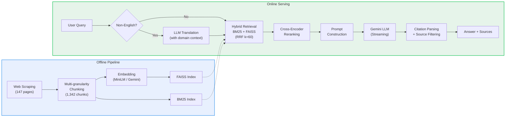

# UChicago Applied Data Science Q&A

A RAG-based Q&A system for the University of Chicago's MS in Applied Data Science program. Users can ask questions about admissions, curriculum, career outcomes, and more — the system retrieves relevant information from the program website and generates answers using an LLM.

**Live Demo:** https://uchicago-ads-rag.web.app


## How It Works

The system is built as a full RAG pipeline with two phases:

**Offline Pipeline** — Run once (or when the source website changes) to prepare the knowledge base:
1. **Web Scraping** — Crawl 147 pages from the UChicago ADS website, preserving HTML structure
2. **Multi-granularity Chunking** — Split pages into 1,342 chunks using structure-aware extractors: accordion items are split by quarter/course/FAQ/job; generic pages use recursive character splitting (800 chars, 150 overlap). Each chunk carries metadata (source URL, heading, chunk type, labels)
3. **Embedding & Indexing** — Encode all chunks with a sentence embedding model (MiniLM-L6 or Gemini-Embed-001) and build a FAISS inner-product index. A BM25 index is built in parallel for lexical matching

**Online Serving** — For each user query:
1. **Query Translation** — Non-English queries (detected by character encoding) are translated to English with domain context, since BM25 and the cross-encoder are English-only
2. **Hybrid Retrieval** — BM25 and FAISS scores are fused via Reciprocal Rank Fusion (k=60), with heading-overlap boosting and per-URL deduplication
3. **Cross-Encoder Reranking** — Top candidates are re-scored with `ms-marco-MiniLM-L-6-v2` for precision
4. **Prompt Construction** — Retrieved chunks are labeled [Doc1], [Doc2], etc. The prompt instructs the LLM to cite sources and respond in the user's language
5. **Streaming Generation** — Gemini LLM generates a token-by-token streamed response via SSE
6. **Citation Filtering** — Only source links actually cited by the LLM are returned; "I don't know" answers suppress all links

## Architecture



- **Backend** — FastAPI server (`main.py` + modular `embedder.py`, `retrieval.py`, `prompt.py`)
- **Frontend** — React + Vite + Tailwind chat interface with real-time streaming

## Project Structure

```
backend/
  main.py              # FastAPI app, endpoints, startup
  embedder.py          # Google Gemini Embedding API wrapper
  retrieval.py         # Hybrid retrieval (BM25 + FAISS + RRF) and reranking
  prompt.py            # Prompt construction, query translation, citation parsing
  requirements.txt
  Dockerfile           # Backend container (Cloud Run)
  .env.example         # Environment variable template
  data/
    chunked_documents.json          # 1,342 chunks with metadata
    embeddings.npy                  # MiniLM embeddings (1342 x 384)
    embeddings_gemini.npy           # Gemini embeddings (1342 x 768)
    uchicago_ads_faiss.index        # FAISS index (MiniLM)
    uchicago_ads_faiss_gemini.index # FAISS index (Gemini)
    uchicago_ads_pages_depth3.json  # Raw crawled pages (147 pages)
  notebooks/
    rag_pipeline.ipynb              # End-to-end pipeline: scraping, chunking, indexing
    test_chunking.ipynb             # Validates multi-granularity chunking across page types
    embedding_comparison.ipynb      # Compares MiniLM vs Gemini embedding quality
  scripts/
    build_gemini_index.py           # Standalone script to rebuild Gemini FAISS index

frontend/
  src/
    App.tsx            # Main app, API streaming logic
    components/
      ChatMessage.tsx  # Message rendering + source links
      ChatInput.tsx    # Text input + send button
      SampleQuestions.tsx  # Sidebar with sample questions
  Dockerfile           # Frontend container (Nginx, for docker-compose)
  firebase.json        # Firebase Hosting config

docker-compose.yml     # Local multi-container setup
deploy.sh              # One-click GCP deployment script
```

## Quick Start

### Backend

```bash
cd backend

# Install dependencies
pip install -r requirements.txt

# Set environment variables
echo "GOOGLE_API_KEY=your-key-here" > .env

# Start the server
uvicorn main:app --reload --host 0.0.0.0 --port 8000
```

### Frontend

```bash
cd frontend

# Install dependencies
npm install

# Start the dev server
npm run dev
```

Open http://localhost:5173

## Environment Variables

| Variable | Required | Default | Description |
|----------|----------|---------|-------------|
| `GOOGLE_API_KEY` | Yes | — | Google AI API key for Gemini LLM and embeddings |
| `EMBEDDING_MODEL` | No | `minilm` | Embedding model: `minilm` (local) or `gemini` (API) |
| `ALLOWED_ORIGINS` | No | `*` | Comma-separated CORS origins (e.g., `https://your-domain.web.app`) |
| `VITE_API_URL` | No | `http://localhost:8000` | Backend URL for the frontend |

## Key Features

- **Hybrid retrieval** — combines BM25 lexical search with FAISS semantic search using Reciprocal Rank Fusion (RRF)
- **Cross-encoder reranking** — re-scores candidates with `ms-marco-MiniLM-L-6-v2` for higher precision
- **Synonym expansion** — maps domain terms (e.g., "tuition" ↔ "cost", "fee", "price") for better BM25 recall
- **Chinese query support** — automatically translates non-English queries to English for retrieval, responds in the user's language
- **Citation-based sources** — only shows source links the LLM actually referenced in its answer
- **Streaming responses** — real-time token-by-token output via Server-Sent Events
- **Configurable embeddings** — switch between local MiniLM (384-dim) and Gemini API (768-dim) via environment variable

## Deployment

The app is deployed on Google Cloud Platform:
- **Backend** — Cloud Run (containerized FastAPI)
- **Frontend** — Firebase Hosting (static files + CDN)

### Deploy with Docker (local)

```bash
docker-compose up --build
# Frontend: http://localhost  |  Backend: http://localhost:8000
```

### Deploy to GCP

Prerequisites: `gcloud` CLI, Firebase CLI, a GCP project with billing enabled.

```bash
# One-click deploy
./deploy.sh
```

The script builds and deploys the backend to Cloud Run, then builds the frontend and deploys to Firebase Hosting. See `deploy.sh` for details.
